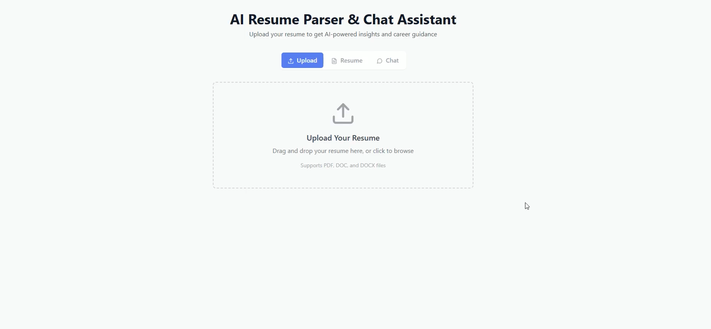
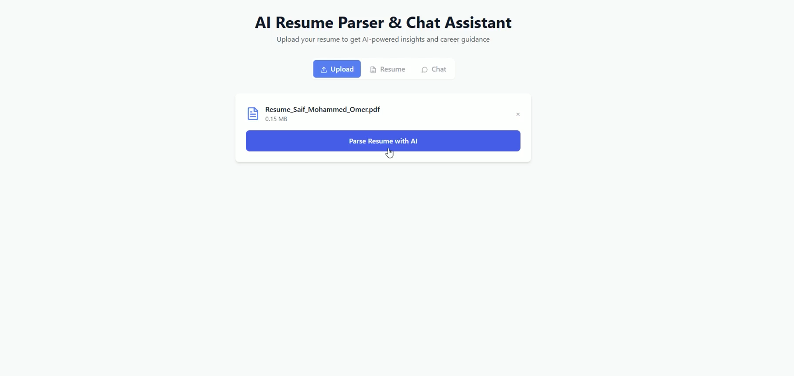
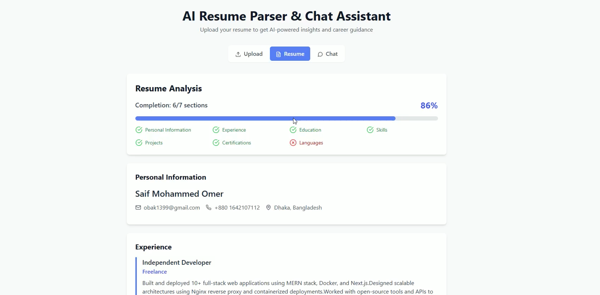
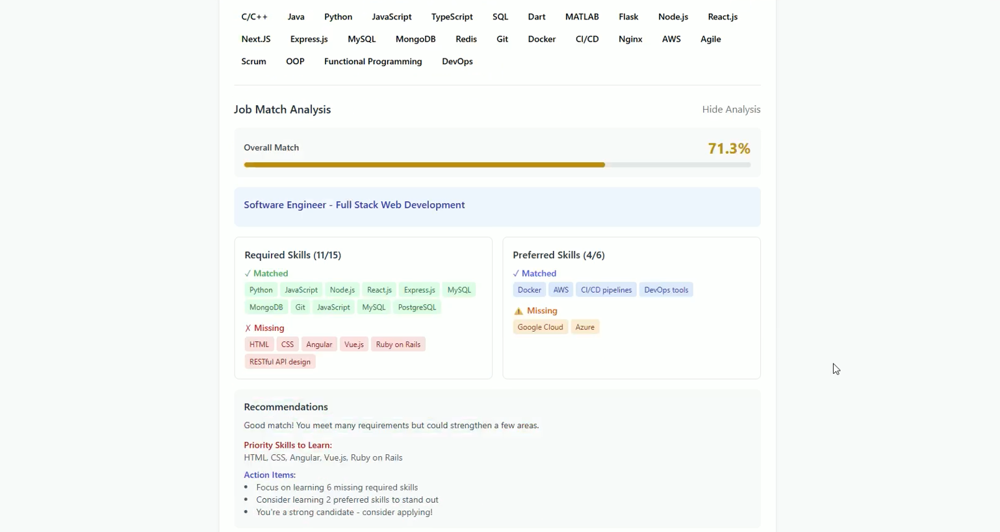
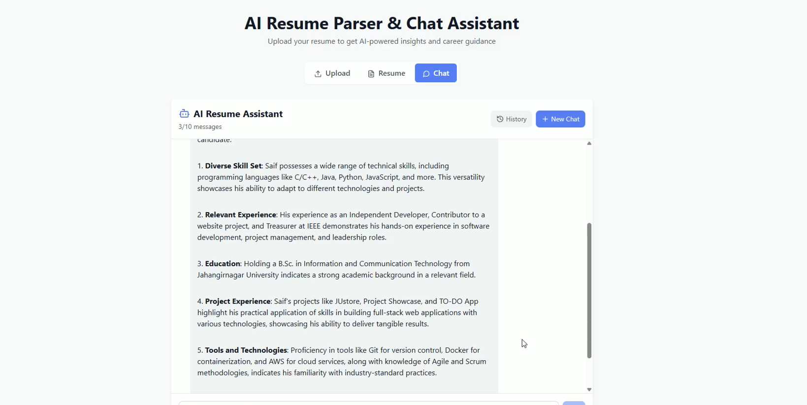

# AI Resume Parser & Chat Assistant

A modern web application that uses AI to parse resumes and provides an intelligent chat assistant for career guidance. Built with Next.js, FastAPI, and PostgreSQL.

## Features

- 📄 **Resume Parsing**: Upload PDF file and extract structured data using VLM.run
- 🤖 **AI Chat Assistant**: Get personalized career advice using OpenAI's GPT models
- 📊 **Resume Analysis**: Visual completion analysis and missing field detection
- 🎨 **Modern UI**: Clean, responsive design with Tailwind CSS
- 🔄 **Real-time Updates**: Polling-based status updates during parsing
- 💬 **Interactive Chat**: Suggested questions and conversation history

## Tech Stack

### Frontend
- **Next.js 14** - React framework
- **TypeScript** - Type safety
- **Tailwind CSS** - Styling
- **Lucide React** - Icons
- **Axios** - HTTP client
- **React Dropzone** - File upload

### Backend
- **FastAPI** - Python web framework
- **SQLAlchemy** - ORM
- **PostgreSQL** - Database
- **OpenAI API** - Chat functionality
- **VLM.run API** - Resume parsing
- **Uvicorn** - ASGI server

## Quick Start

### Prerequisites
- Docker and Docker Compose installed on your PC

### Setup (5 minutes)

1. **Clone the repository**
   ```bash
   git clone https://github.com/esimo13/nymph-docker.git
   cd nymph-docker
   ```

2. **Create environment file**
   ```bash
   # Create .env file in root directory with all required configuration
   echo "OPENAI_API_KEY=your_openai_key_here" > .env
   echo "VLM_API_KEY=your_vlm_key_here" >> .env
   echo "VLMRUN_API_KEY=your_vlm_key_here" >> .env
   echo "VLM_API_URL=https://api.vlm.run/v1/chat/completions" >> .env
   
   # Note: Database and frontend configs are handled automatically by Docker
   ```

3. **Start the application**
   ```bash
   docker-compose up --build
   ```

4. **Open in browser**
   - 🌐 **App**: http://localhost:3000
   - 📚 **API Docs**: http://localhost:8002/docs

That's it! The app will work with demo data even without API keys.

## What You Get

- 📄 **Resume Parser**: Upload PDF/DOC files and get structured data
- 🤖 **AI Chat**: Get career advice about your resume
- 📊 **Job Matching**: Upload job descriptions for skill analysis
- 🎯 **Mock Data**: Works without API keys for testing

## How It Works

```
project-root/
├── backend/
│   ├── app/
│   │   ├── main.py          # FastAPI application
│   │   ├── vlm.py           # VLM.run integration
│   │   ├── openai_chat.py   # OpenAI chat functionality
│   │   ├── db.py            # Database configuration
│   │   ├── models.py        # SQLAlchemy models
│   │   └── schemas.py       # Pydantic schemas
│   ├── Dockerfile
│   └── requirements.txt
├── frontend/
│   ├── pages/
│   │   └── index.tsx        # Main application page
│   ├── components/
│   │   ├── ResumeViewer.tsx # Resume display component
│   │   └── ChatAssistant.tsx # Chat interface
│   ├── styles/
│   │   └── globals.css
│   ├── Dockerfile
│   └── package.json
├── docker-compose.yml
├── README.md
└── .env.example
```

## How It Works

1. **Upload Resume**: Drag & drop your PDF/DOC file
2. **Parse**: AI extracts your information automatically  
3. **Chat**: Ask questions about improving your resume
4. **Job Match**: Upload job descriptions to see skill matches

## Try These Questions

- "What are the strongest points of this resume?"
- "What skills should I add to be more competitive?"
- "How can I improve my experience section?"
- "What projects should I build to strengthen my portfolio?"

## Need Help?

If something doesn't work, check:
1. Docker is running
2. Ports 3000 and 8002 are free
3. Try `docker-compose down` then `docker-compose up --build`

## API Keys (Optional)

The app works without API keys using demo data. For real functionality:

### Root .env file (required for real API responses):
```bash
OPENAI_API_KEY=your_openai_key_here
VLM_API_KEY=your_vlm_key_here  
VLMRUN_API_KEY=your_vlm_key_here
VLM_API_URL=https://api.vlm.run/v1/chat/completions
```

### Additional files (Docker handles these automatically):
- `backend/.env` - Backend-specific config (auto-generated)
- `frontend/.env.local` - Frontend API config (auto-generated)
- Database config is handled by docker-compose.yml

**For real responses (not mock data):**
- Get OpenAI API key from https://platform.openai.com/
- Get VLM.run API key from https://vlm.run/


## 📸 Screenshots

### 🖥️ Home Page


### 🧠 Upload Page


### 📊 Resume Parsed Page


### 🔒 Job Description Page


### 📝 Chat Assistant Page


## 📂 Live Link 
https://nymph-frontend.onrender.com/

